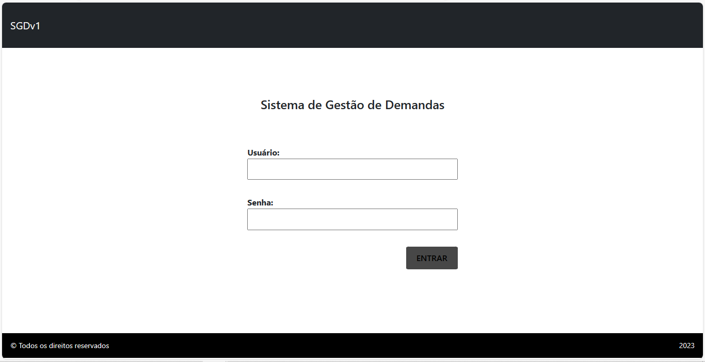
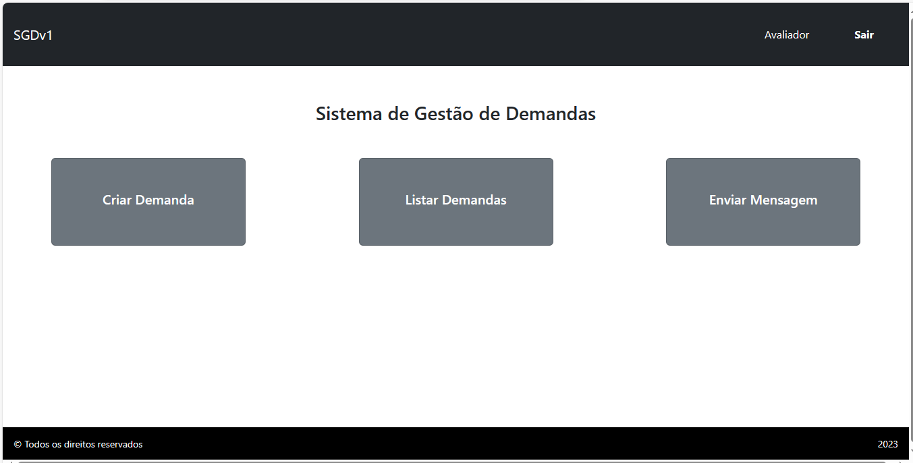
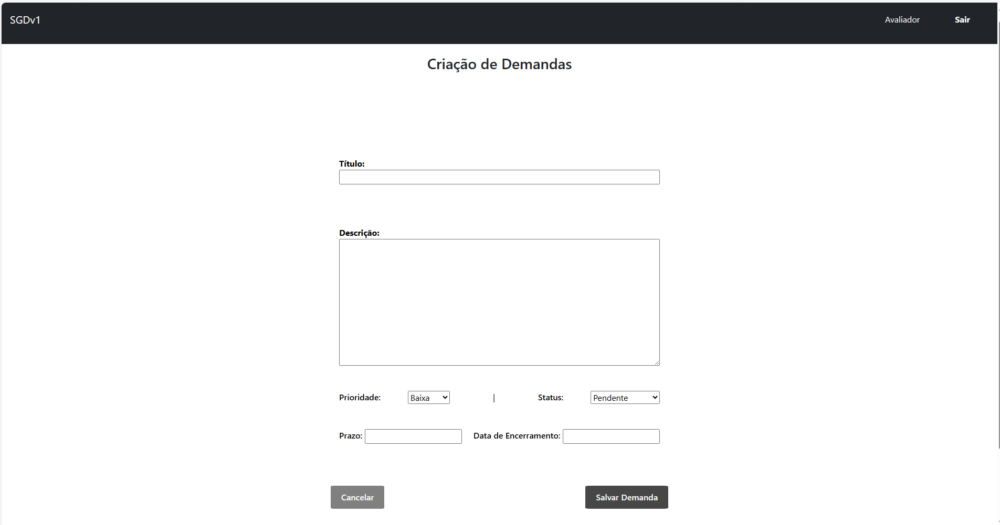
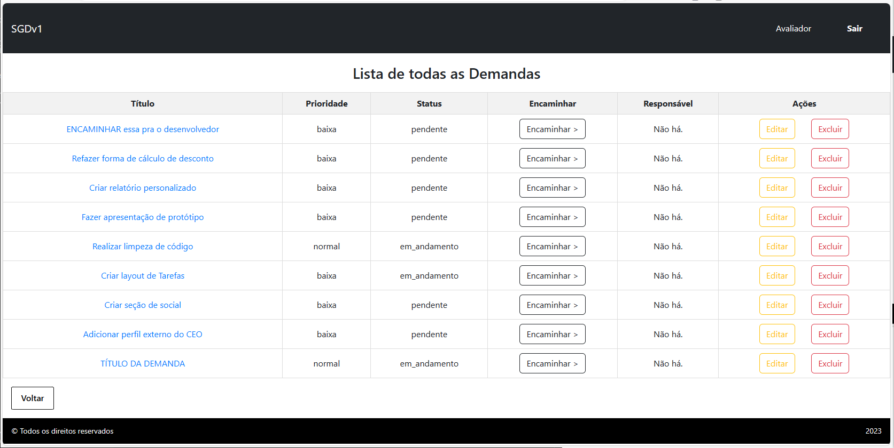
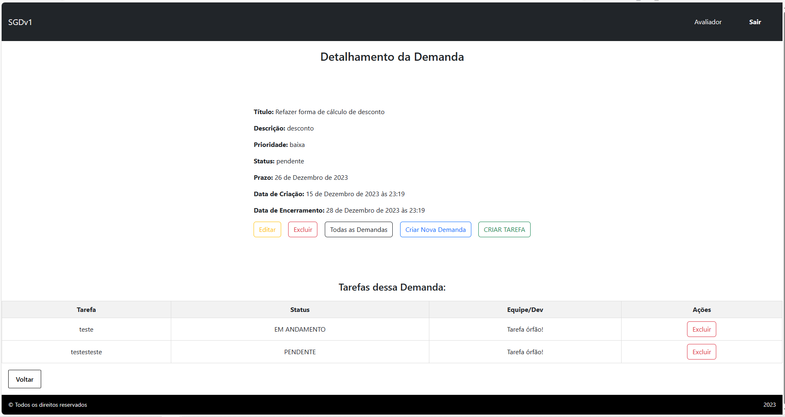

### Sistema de gestão de demandas de software

O objetivo do sistema é gerenciar e organizar as demandas de desenvolvimento de software para uma empresa. Cada demanda é composta por rótulo, descrição, situação, prioridade, data de criação e encerramento e um prazo.

Existem três tipos de usuários do sistema: **Cliente, Avaliador e Desenvolvedor.**

O **Cliente** é quem solicita o desenvolvimento de algum software ou aplicativo. Ele é responsável por solicitar as demandas à equipe responsável através do preenchimento de um formulário. Nesse formulário, ele informa o rótulo e a descrição da demanda requerida. O Cliente também pode consultar todas as demandas cadastradas por ele e detalhar todas as informações.

O **Avaliador** tem a responsabilidade de analisar a necessidade do pedido e encaminhar as demandas ao(s) desenvolvedor(es) responsável(is). Ele pode visualizar, editar e cancelar todas as demandas cadastradas. Além disso, ele também pode trocar mensagens referentes a uma demanda na área específica.

O **Desenvolvedor** recebe as demandas cadastradas pelo Cliente e
encaminhadas pelo Avaliador. Ele pode trocar mensagens com o cliente e criar tarefas para detalhar as demandas pelas quais é responsável.

#### 👉 [Clique aqui e assista a demonstração no YouTube. 👈](https://youtu.be/pVo_GkyEZus)

------

#### Telas do Sistema:

 

Login:

 

Início:

 

Criação de Demanda:

 

Lista de Demandas:

 

Detalhamento de Demanda:
